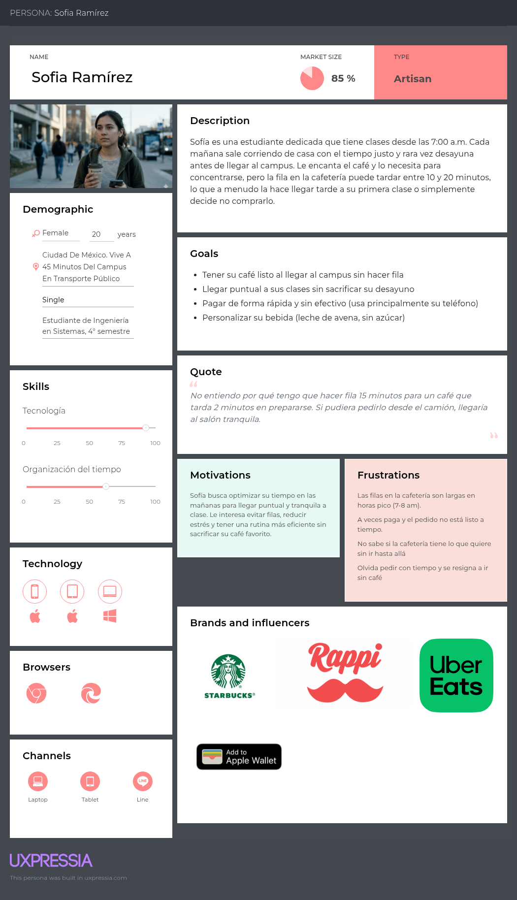

# Persona 1 — Sofía Ramírez

## Perfil general

| Campo | Detalle |
|---|---|
| **Nombre** | Sofía Ramírez |
| **Edad** | 20 años |
| **Ocupación** | Estudiante de Ingeniería en Sistemas, 4° semestre |
| **Ubicación** | Vive a 45 minutos del campus en transporte público |
| **Tecnología** | Alta — usa smartphone constantemente, nativa digital |

---

## Descripción

Sofía es una estudiante dedicada que tiene clases desde las 7:00 a.m. Cada mañana sale corriendo de casa con el tiempo justo y rara vez desayuna antes de llegar al campus. Le encanta el café y lo necesita para concentrarse, pero la fila en la cafetería puede tardar entre 10 y 20 minutos, lo que a menudo la hace llegar tarde a su primera clase o simplemente decide no comprarlo.

---

## Objetivos

- Tener su café listo al llegar al campus sin hacer fila
- Llegar puntual a sus clases sin sacrificar su desayuno
- Pagar de forma rápida y sin efectivo (usa principalmente su teléfono)
- Personalizar su bebida (leche de avena, sin azúcar)

---

## Frustraciones

- Las filas en la cafetería son largas en horas pico (7–8 a.m.)
- A veces paga y el pedido no está listo a tiempo
- No sabe si la cafetería tiene lo que quiere sin ir hasta allá
- Olvidar pedir con tiempo y resignarse a ir sin café

---

## Comportamiento tecnológico

- Usa apps de delivery (Rappi, Uber Eats) con frecuencia
- Paga con tarjeta o billetera digital; raramente carga efectivo
- Revisa su teléfono en el camino al campus
- Valora las apps simples y rápidas; abandona si hay demasiados pasos

---

## Cita representativa

> _"No entiendo por qué tengo que hacer fila 15 minutos para un café que tarda 2 minutos en prepararse. Si pudiera pedirlo desde el camión, llegaría al salón tranquila."_

## Referencia de persona hecha con UXPressia

---

## Escenario de uso

Sofía va en el transporte a las 6:40 a.m. Abre **CafItamita**, selecciona su cappuccino con leche de avena favorito (ya guardado), elige pagar con QR y programa la entrega para las 7:05 a.m. Al llegar al campus, pasa por la cafetería, recoge su café en 30 segundos y entra al salón puntual.
