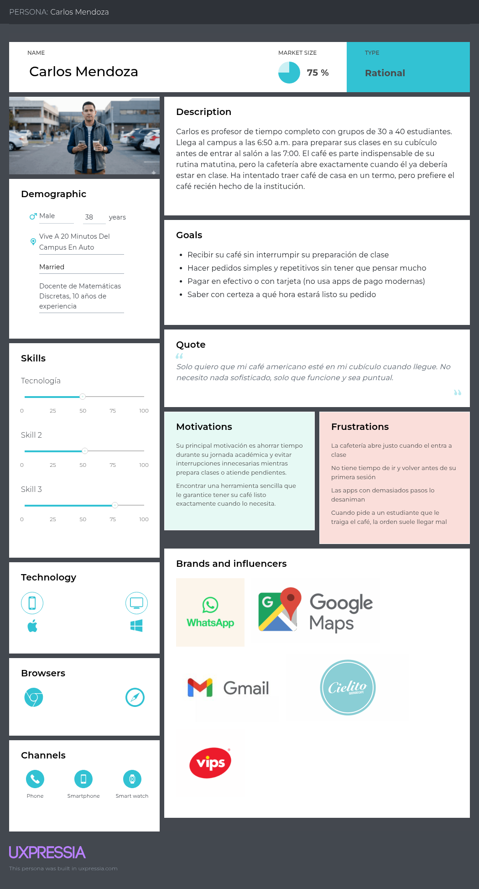

# Persona 2 — Carlos Mendoza

## Perfil general

| Campo | Detalle |
|---|---|
| **Nombre** | Carlos Mendoza |
| **Edad** | 38 años |
| **Ocupación** | Docente de Matemáticas Discretas, 10 años de experiencia |
| **Ubicación** | Vive a 20 minutos del campus en auto |
| **Tecnología** | Media — usa smartphone para lo esencial, prefiere lo intuitivo |

---

## Descripción

Carlos es profesor de tiempo completo con grupos de 30 a 40 estudiantes. Llega al campus a las 6:50 a.m. para preparar sus clases en su cubículo antes de entrar al salón a las 7:00. El café es parte indispensable de su rutina matutina, pero la cafetería abre exactamente cuando él ya debería estar en clase. Ha intentado traer café de casa en un termo, pero prefiere el café recién hecho de la institución.

---

## Objetivos

- Recibir su café sin interrumpir su preparación de clase
- Hacer pedidos simples y repetitivos sin tener que pensar mucho
- Pagar en efectivo o con tarjeta (no usa apps de pago modernas)
- Saber con certeza a qué hora estará listo su pedido

---

## Frustraciones

- La cafetería abre justo cuando él entra a clase, no puede ir
- No tiene tiempo de ir y volver antes de su primera sesión
- Las apps con demasiados pasos o registro complicado lo desaniman
- Cuando pide a un estudiante que le traiga café, la orden suele llegar mal

---

## Comportamiento tecnológico

- Usa WhatsApp, correo y Google Maps principalmente
- Prefiere interfaces con texto grande y flujos cortos
- Desconfía de las apps que piden demasiados permisos
- Valora la consistencia: si algo funcionó bien una vez, lo repite

---

## Cita representativa

> _"Solo quiero que mi café americano esté en mi cubículo cuando llegue. No necesito nada sofisticado, solo que funcione y sea puntual."_

---

## Escenario de uso

Carlos llega al estacionamiento a las 6:45 a.m. Antes de bajar del auto abre **CafItamita**, selecciona su pedido habitual (americano grande, sin azúcar), elige pagar en efectivo al recoger y confirma entrega para las 7:55 a.m. (su receso entre clases). La app le manda una notificación cuando el café está listo y él pasa a recogerlo en el inter.

## Referencia de persona hecha con UXPressia

